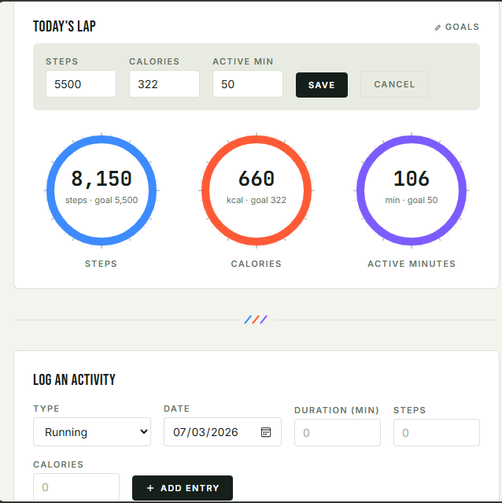

# 🏋️ Pase Fitness Tracker 

A modern and responsive ** Pace Fitness Tracker ** web application built using **HTML, CSS, and JavaScript**. It helps users track their daily fitness activities, monitor progress, and store records locally in the browser.

---

## 🚀 Features

- 👣 Track daily steps
- 🔥 Record calories burned
- 🏃 Log workout duration
- 📝 Add exercise type
- ✏️ Edit activities
- 🗑️ Delete activities
- 🔍 Search activities
- 🌙 Dark Mode
- 📊 Weekly progress chart using Chart.js
- 📈 Animated progress bars
- 💾 Local Storage (data saved after refresh)
- 📱 Fully responsive design
- ✨ Modern Glassmorphism UI

---

## 🛠️ Technologies Used

- HTML5
- CSS3
- JavaScript (ES6)
- Chart.js
- Font Awesome
- Google Fonts (Poppins)
- Local Storage API

---

## 📂 Project Structure

```
Fitness-Tracker-Pro/
│── index.html
│── style.css
│── script.js
│── README.md
```

---

## 📸 Screenshot

## Screenshot


---

## ▶️ How to Run

1. Download or clone this repository.
2. Open the project folder.
3. Double-click **index.html** or open it in your web browser.
4. Start adding your fitness activities.

---

## 🌐 Live Demo

(https://husnainraza313.github.io/Pase-Fitness-Tracker/)


## 🎯 Project Objective

This project was developed as **Task 3** for the **CodeAlpha Web Development Internship**.

The objective was to create a fitness tracking application that allows users to log and manage their daily fitness activities through a clean, responsive, and interactive interface.

---

## 🔮 Future Improvements

- Firebase Database Integration
- User Login & Registration
- BMI Calculator
- Water Intake Tracker
- Sleep Tracker
- Monthly Reports
- Export Data to PDF
- Mobile App Version

---

## 👨‍💻 Developed By

**Muhammad Husnain Raza**

Computer Science Student

CodeAlpha Web Development Intern


## 📄 License

This project is open-source and available under the MIT License.
